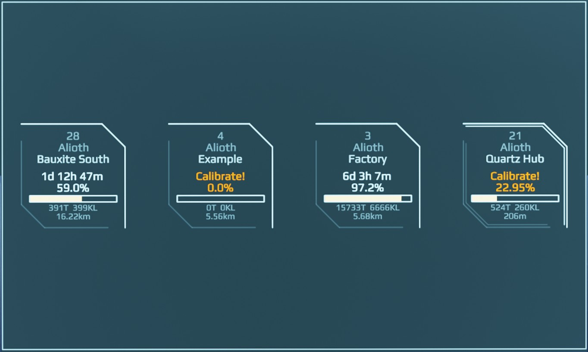
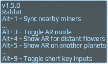
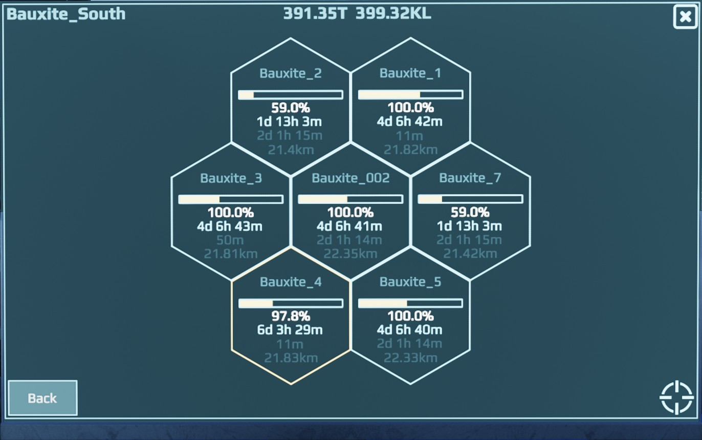
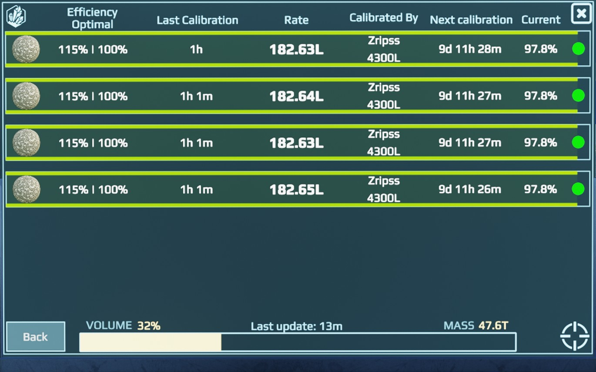

# MinerSuite

Quanta can be sent to Zripss :P

## Instalation

This is 2 part instalation, one for mining site where your miners are at and one for your dynamic core, aka ship.

### Mining site setup
 You will need:
   * ProgramableBoard
   * Receiver
   * Emmiter

Copy/paste LUA code from [HERE](https://raw.githubusercontent.com/GcGoat/MinerSuite/main/MiningSiteLUA) into your Programable board (PB), from PB link to all elements, which would be: receiver, emmitter, container (or hub) and all mining units  

**Attention #1** You will need to link FROM receiver to PB in adition to linking PB to receiver, it will have blue and green links between these 2 elements 

Now right click PB and enter into "Edit Lua Parameters" there are 2 ESSENTIAL values you need to update
 * **flowerName** - this defines entire mining flower with unique name, this will allow us to group miners in same area for simpler visualization
 * **emitterChannel** - is unique name you came up to separate your miners from everyone else, make it as unique as posible and keep it same across all your mining sites  

**Attention #2** Mining site core name needs to be unique for this entire flower, so name it acordingly. You can use names like "Coal_1" (without quotes) and then second one like "Coal_2". Format of the name isint essential, but try to keep it short

### Ship setup
 You will need:
   * ProgramableBoard
   * Receiver
   * Emmiter
   * Screen (optional)
   * DataBank

Copy/paste LUA code from [HERE](https://raw.githubusercontent.com/GcGoat/MinerSuite/main/ShipsPBLUA) into your Programable board (PB). FIRST LINK goes to receiver, remaining can go in any order. So links from PB goes to: Receiver, Emmiter, Databank and Screen.
  
**Attention #1** You will need to link FROM receiver to PB in adition to linking PB to receiver, same as it was for mining site, it will have blue and green links between these 2 elements 
  
Now right click PB and enter into "Edit Lua Parameters" there is only one ESSENTIAL value you need to update
 * **emitterChannel** - same channel name you used for mining sites
   
Adiotional options you need to adjust
* **containerProficiency** - value between 1 and 5 based on your talents levels
* **containerOptimization** - value between 1 and 5 based on yoru talents levels
  
Without providing correct values it will report incorrect container values, will not effect miner status
  
Optionally change **minimalCalibration** value to whatever value you want between 0 and 100. This determines timer report when recalibaration will be needed to keep it above defined percentage amount. 

### Done
At this point you are fully setup and you can startup PB on your ship. Screen should be blank but turn on. Now you will only need to turn on Mining Site PB once, just turn it on and off. (At this time you will need to relaunch ships PB for new mining site to appear).  
When that's done you should get AR mode on you screen showing detected miners and container with their status. Repeat Mining site setup for every mining site you have. This is one time setup, after that mining site status will be updated automatically each time you visit it to calibrate while having ship PB enabled. 

## Updating
When you update script on your ship (miner sites will not need any updates, its fine as it is) don't forget to update emitterChannel as it will get a reset

## Synchronization
  
You can synchronize mining sites status between 2 ship PB's, setup is exactly the same for both ships, what you only need to do is turn both of them on (dont turn on third one, it will derp out). When 2 ship PB's are on you will get progress bar on your screen, this can repeat twice, after its over you can turn off one of the PB's and you are done. Depending on record amount this can take from a second to multiple ones, so just keep calm and enjoy view while its doing its thing.  

# Recommendation 
Have one central PB at your main org base which is used to synchronize latest information between ships, so that everyone who does mining site calibrations can synchroniza data before going to sites and after returning from those. If you are playing solo then this is not nesecerry. 

# Manual mode
At this moment in time there is no way to update miners status if you are visiting those over VR. This can be mitigated somewhat by using manual edit mode. Selecting apropriate mining site you can click on left top corner icon which will enable manual edit mode, adjust calibration values by simply click and drag action and click on save button. This will reset timers and record you as a last person who calibrated it. 

# Extra information
 * Main screen will list all mining flowers in record. Top value indicates miner count. Name of flower. Timer when soonest miner will neeed recalibration, it will be shown in blue if time until recalibration is over 24 hours, in yellow if recalibration will be needed sooner than 24 hours and word "Calibrate!" will be shown when calibration is under previous defined minimalCalibration value. Lowest minimal calibration will be shown at all times. And last value is distance to this flower. Entire flower block can be enclosed with double line which will indicate it being closest to you.
 * Secondary window shows all mining sites for that mining flower. At the top you will see predicted total ore amount in weight and volume. These values are being predicted, so actual value can be slightly different. You will have option to remove this flower by clicking in X, keep in mind that this would be needed to be done on all databases, otherwise it will be readded with next synchronization. Right bottom corner can be pressed to set destination to this flower center point.
 * Mining site screen. Top left icon enables manual mode. Top right can remove mining site from records. Bottom right sets destination to it.
 * Main screen will have lock symbol on bottom right corner, this indicates if databank is in locked state or not. When its locked then it will no longer accept new records for new flowers or mining sites, it will accept updates for existing ones. This can be useful to avoid accidental aditions to existing database. This can be locked/unlocked by modifying LUA settings

# AR mode
This mode will provide all the information you might need. You will see locations of all minig flowers with their basic information. You can hover over any of these to get more detailed information about it. You can hover over it and mouse click it to set destination to it. Getting closer to mining flower will update its AR visualization with more and more detailed information. You can turn off AR mode by pressing ALT+3

# ToolTip

* Top line indicates version of the code
* Fallowed by ships name. This will change if you have second ships PB enabled to indicate linkage between 2 cores
* Alt+1 short cut wil manually attempt to grab data from closest mining sites. This is not needed to be done as it should be performed automatically, but you can try to synchronize data this way. Keep in mind that mining site needs to be loaded in for it to work
* Alt+3 will toggle AR mode completely on and off
* Alt+4 will show or hide flowers which are not the closest one, so only one closest flower could be shown on screen
* Alt+5 will hide all flowers on different planets
* Alt+9 will toggle off all previously mentioned keys on and off. Your options will be saved, so after picking what you want, disable their shortcuts to avoid compatability issues with flight scripts like ArchHud

